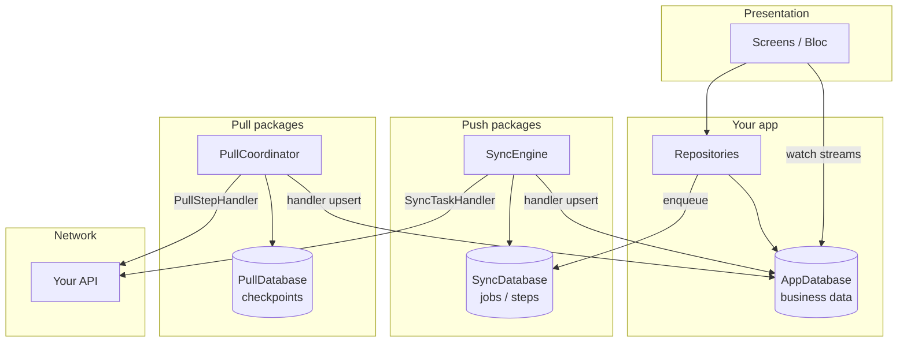

# Architecture

## High-level flow



## Three databases

Never merge these in documentation or mental model:

| Database | File (default) | Owner | Stores |
| --- | --- | --- | --- |
| **AppDatabase** | `app.sqlite` (your choice) | **Your app** | Documents, orders, settings, … |
| **SyncDatabase** | `sync_core.sqlite` | `offline_sync_core` | Outbox jobs and steps |
| **PullDatabase** | `offline_sync_pull.sqlite` | `offline_sync_pull` | Pull checkpoints only |

Packages **never** open your `AppDatabase`. Handlers you write call your DAOs/local datasources.

## Reconnect order

When connectivity returns:

1. **Push** — `await engine.syncAll()` (flush write queue)
2. **Pull** — `await pullCoordinator.runAll()` (or per-feature)

Foreground adapters (`FlutterSyncCoordinator`, `FlutterPullCoordinator`) trigger on connectivity; you can also run manually.

## Background Workmanager

One callback can run both:

```dart
await runBackgroundSync(createBackgroundSyncEngine);
await runBackgroundPull(createBackgroundPullCoordinator);
```

Each factory re-opens package DBs at the same paths and rebuilds Dio + registries.

## Clean architecture placement

| Piece | Layer |
| --- | --- |
| `SyncTaskHandler` / `PullStepHandler` | Data (adapters) |
| `buildRegistry` / `buildPullRegistry` | App DI / infrastructure |
| `SyncEngine` / `PullCoordinator` | Infrastructure |
| Repositories, App DB | Data |
| Bloc / UI | Presentation |

See [Clean architecture](/guide/clean-architecture) for folder layout.
